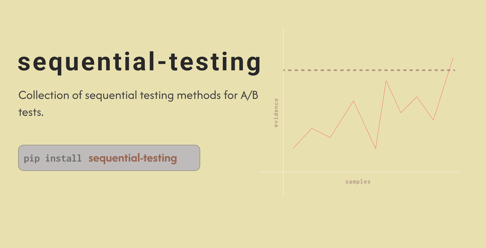
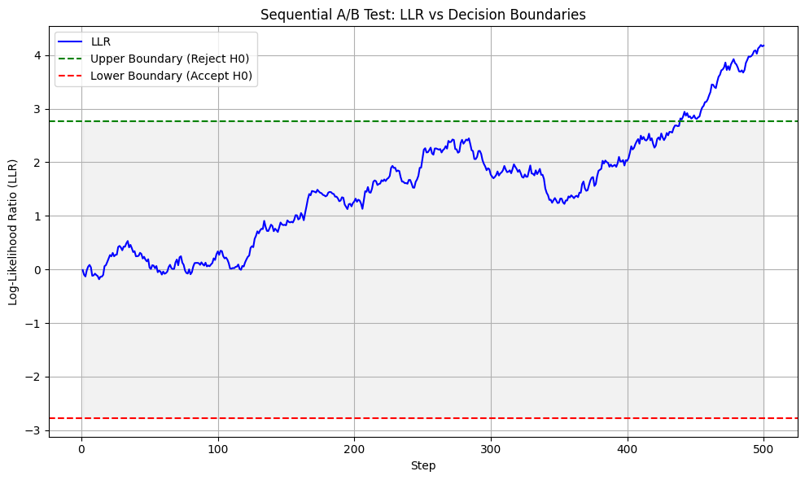
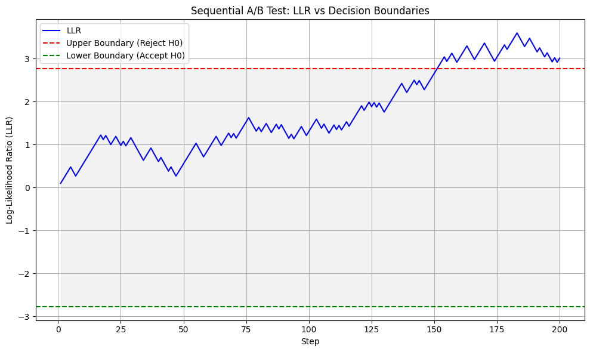
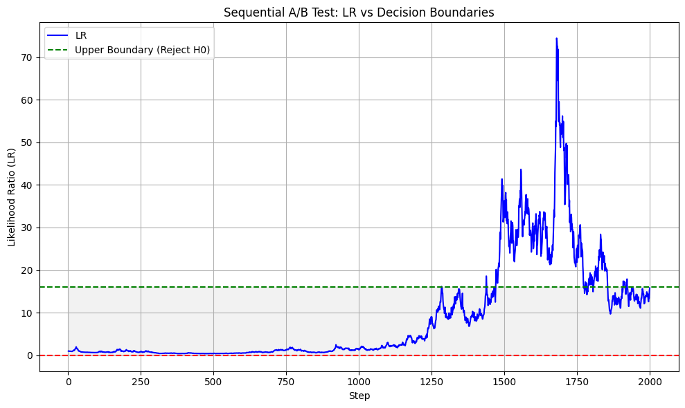

# sequential-testing

<p align="center">
  
</p>

Python library for Sequential testing methods for A/B tests. Currently supporting:
- Sequential Probability Ratio Test (SPRT)
- Mixture Sequential Probability Ratio Test (mSPRT)

## Installation

```bash
pip install sequential-testing
```


## Usage

### SPRT

#### normal distribution

```python
import numpy as np
from sequential-testing  import SPRTNormal
seed = 7
random_normal = np.random.default_rng(seed)

sample_size = 500
samples_x = random_normal.normal(loc=0.5, scale=1, size=sample_size)
samples_y = random_normal.normal(loc=0.58, scale=1, size=sample_size)


sprt_normal = SPRTNormal(alpha=0.05, beta=0.2, sigma=1, h0=0., h1=0.05 )
sprt_normal.fit(x_values=samples_x, y_values=samples_y)
sprt_normal.plot()
```
 

we can inspect the LLR value and step when the null hiphotesis got rejected or accepted
```python
print(sprt_normal.h0_rejected)  # return a list of tuples (LLR, step)
print(sprt_normal.h0_acepted)
```

#### binomial distribution

```python
import numpy as np
from sequential-testing  import SPRTBinomial

x_values = [1,0,1,0,1,0,1,0,1,1] * 20  # conv rate = 0.6
random.shuffle(x_values)

a = SPRTBinomial(method="fixed",alpha=0.05, beta=0.2, h0=0.5, h1=0.55)
a.fit(x_values)
a.plot()
```
 

we can inspect the LLR value and step when the null hiphotesis got rejected or accepted
```python
print(sprt_normal.h0_rejected)  # return a list of tuples (LLR, step)
print(sprt_normal.h0_acepted)
```
### mSPRT

#### normal distribution

```python
import numpy as np
from sequential-testing  import MSPRTNormal

seed = 9
random_normal = np.random.default_rng(seed)

sample_size = 2000
samples_x = random_normal.normal(loc=0.1, scale=1, size=sample_size)
samples_y = random_normal.normal(loc=.13, scale=1, size=sample_size)


msprt_normal = MSPRTNormal(
    alpha=0.05,
    beta=0.2,
    sigma=1,
    tau=None, # if None then tau gets calculated
    h0=0.1,
    m=sample_size,
)
msprt_normal.fit(x_values=samples_x, y_values=samples_y)
msprt_normal.plot()
```
 

we can inspect the LLR value and step when the null hiphotesis got rejected or accepted
```python
print(sprt_normal.h0_rejected)  # return a list of tuples (LLR, step)
print(sprt_normal.lr) # return the list of Likehood Ratio values
```

## License

MIT License